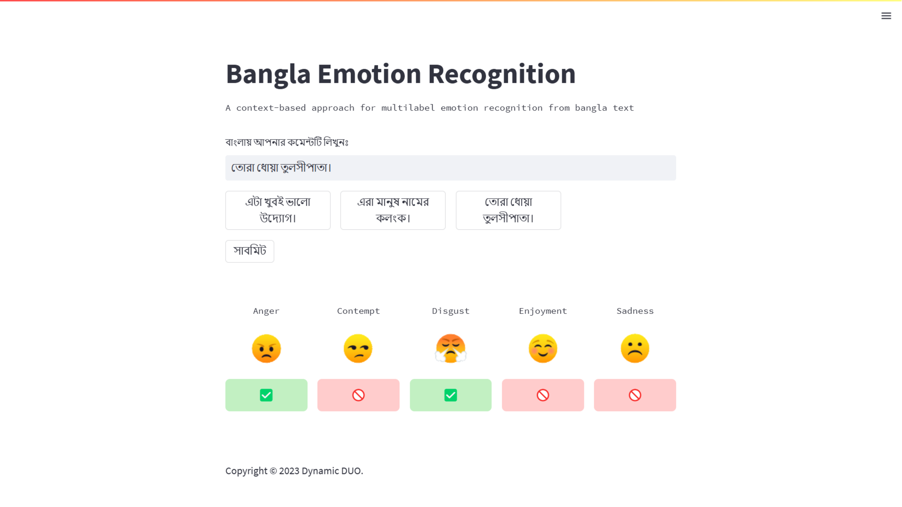

# Multilabel Emotion Recognition in Bangla Web Application

## Tools
- Streamlit
- Pytorch for loading model
- Pyngrok for deploy

## Web Interface

## Usage
- Enter your Bangla text
- Submit 
- It will show the predicted emotions ✅ as Emotion present on the text, and 🚫 as not present

## Contact
[Shumaiya Akter Shammi](https://github.com/Shammi179)  
[Sajal Das](https://github.com/sajaldoes)  
  
    

## License
Copyright &copy; 2023 Dynamic DUO